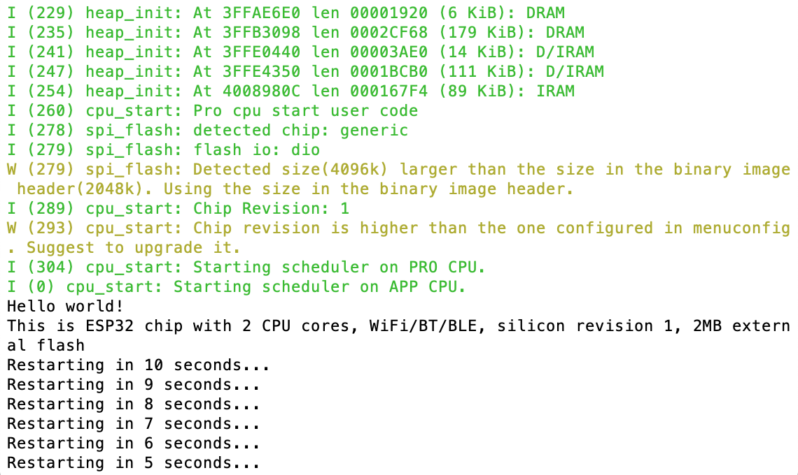
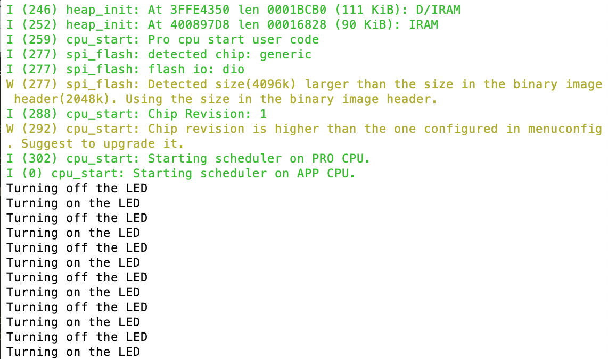

#  Skill Name

Author: David Kirk, 2019-09-05

## Summary
I installed the toolchain and got the hello-world and blink programs running on the micro.

## Sketches and Photos
hello-world:

blink:

## Modules, Tools, Source Used in Solution
idf.py toolchain

## Supporting Artifacts

-----

## Reminders
- Repo is private
