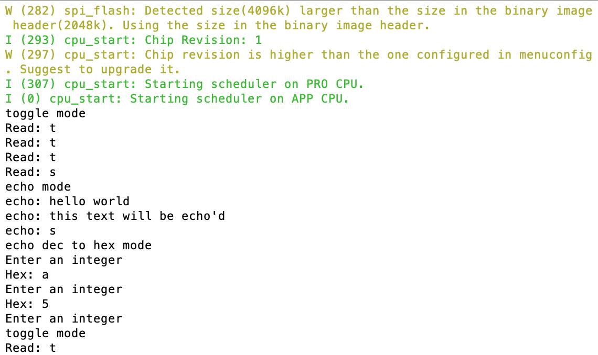

#  Skill Name

Author: David Kirk, 2019-09-06

## Summary
Implemented the console-io skill as described. Switch modes with s, toggle LED in toggle mode with t, echo text in echo mode, and convert decimals to hex in hex mode.

## Sketches and Photos

## Modules, Tools, Source Used in Solution
Standard idf.py toolchain, given console demo code

## Supporting Artifacts

-----

## Reminders
- Repo is private
