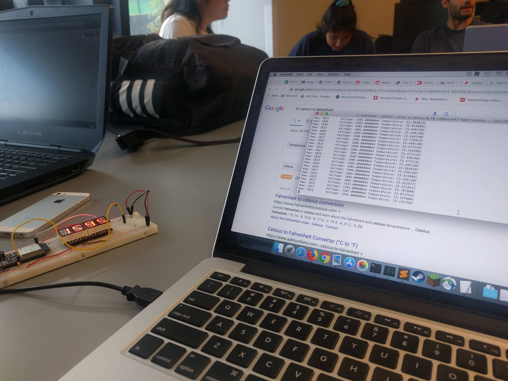

#  Thermistor

Author: David Kirk, 2019-09-26

## Summary
This program reads the voltage coming off a NTC mf52-103 thermistor wired into a voltage divider with a 10Kohm resistor. It prints the raw input, voltage, and converted temperature in celsius. It also displays the current voltage to the 14-segment display because it uses the same basic code as the battery skill.

## Sketches and Photos

## Modules, Tools, Source Used in Solution
Standard idf.py toolchain, battery skill, https://www.ametherm.com/thermistor/ntc-thermistor-beta.

## Supporting Artifacts

-----

## Reminders
- Repo is private
