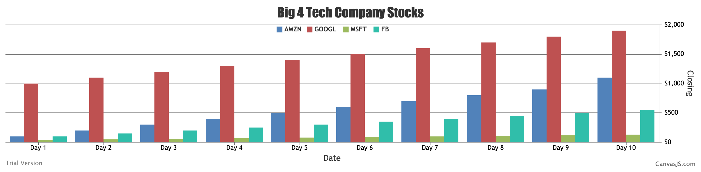

#  Data Visuals

Author: David Kirk, 2019-10-03

## Summary
This is a node webapp that displays a bar chart from a csv file.

## Sketches and Photos

## Modules, Tools, Source Used in Solution
The express, body-parser, csvtojson, xmlhttprequest, http, and fs modules, and also my Senior Design miniproject.

-----

## Reminders
- Repo is private
