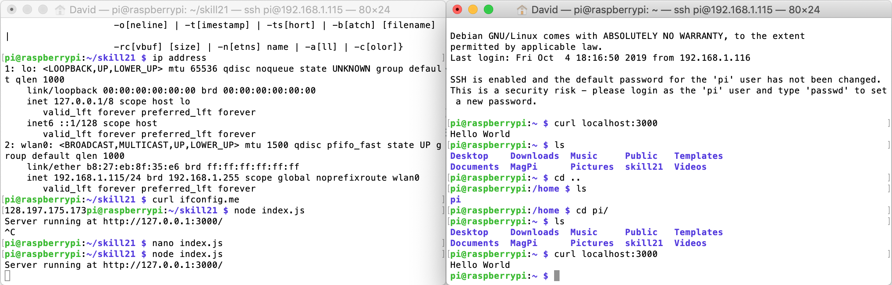

#  Raspberry Pi

Author: David Kirk, 2019-10-04

## Summary
Got the raspberry pi running, installed Node, and tested web server capabilities.

## Sketches and Photos

## Modules, Tools, Source Used in Solution
Node tutorial: https://nodejs.org/en/docs/guides/getting-started-guide/

-----

## Reminders
- Repo is private
