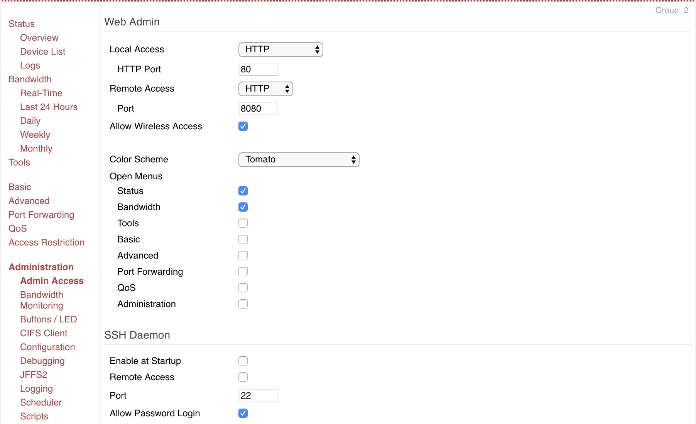
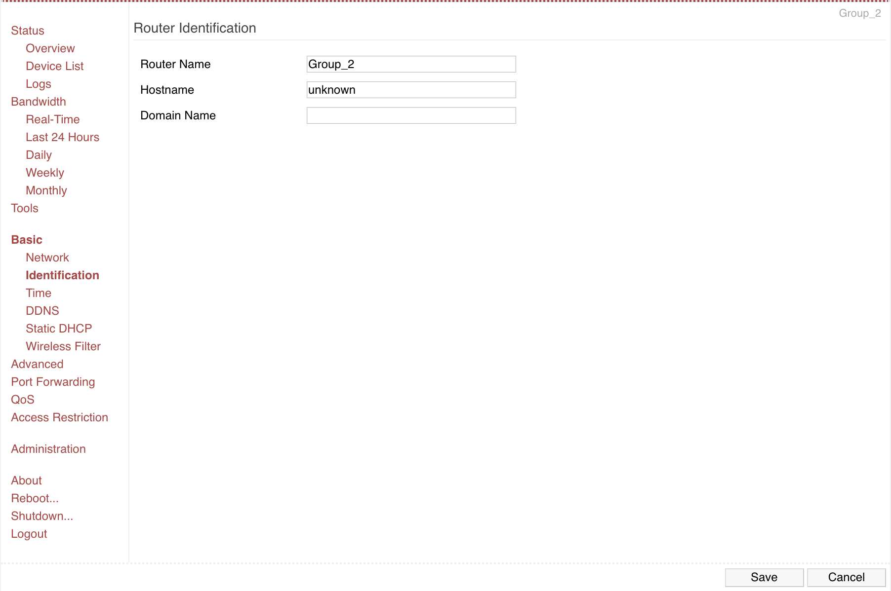
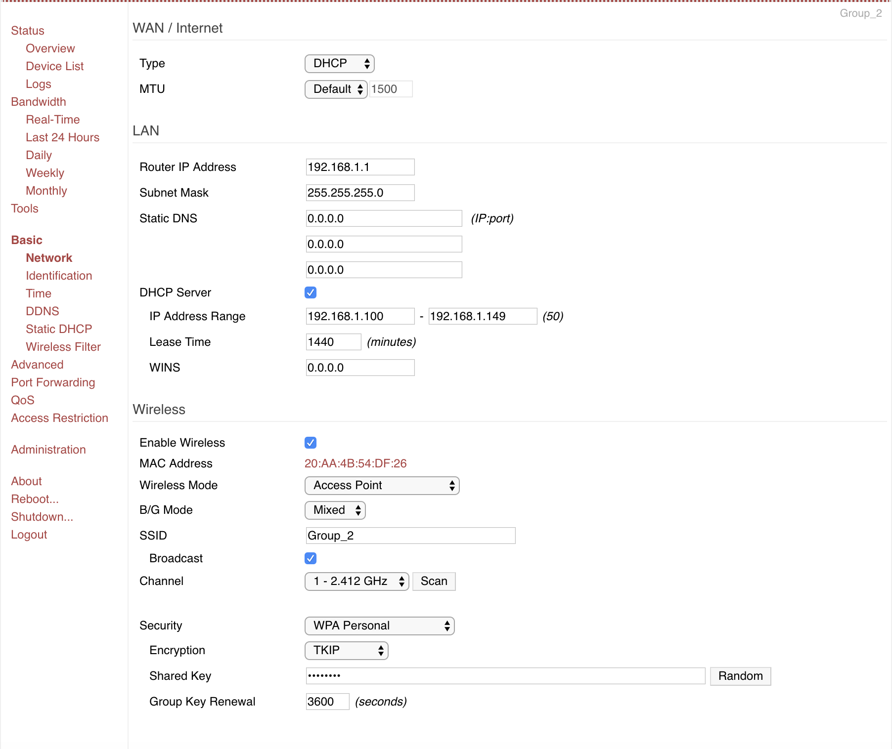
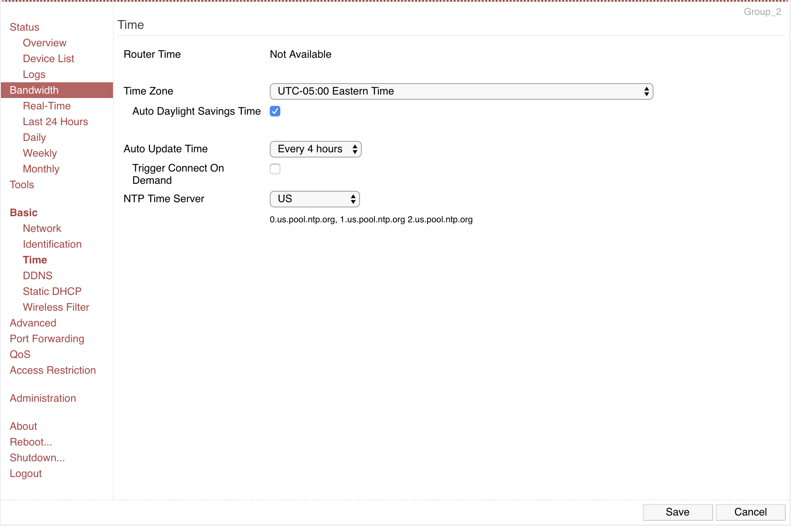

#  Router

Author: David Kirk, 2019-10-24

## Summary
This skill entailed setting up the provided router with Tomato software. We configured it to have an SSID of "Group_2" and a password, and used it to control the raspberry pi headlessly.

## Sketches and Photos

## Modules, Tools, Source Used in Solution
Tomato 1.28

-----

## Reminders
- Repo is private
