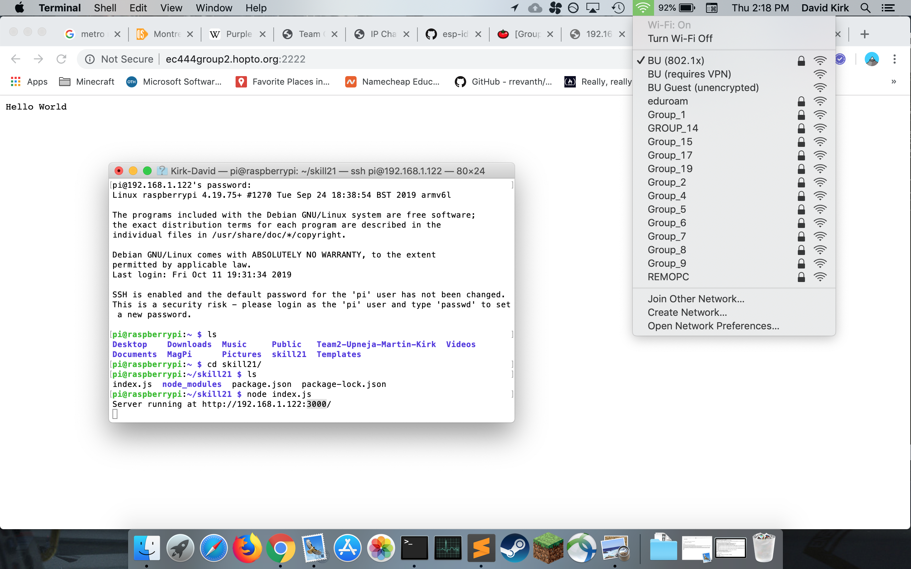

#  Dynamic DNS

Author: Kyle Martin, Ayush Upneja, David Kirk (team skill), 2019-10-15

## Summary
We set up DDNS and port forwarding for the Raspberry Pi on the router with No-IP. We chose the domain "ec444group2.hopto.org" with the public port 2222 to allow the server to be visible from the greater internet.

## Sketches and Photos

## Modules, Tools, Source Used in Solution
Tomato router software, No-IP

-----

## Reminders
- Repo is private
