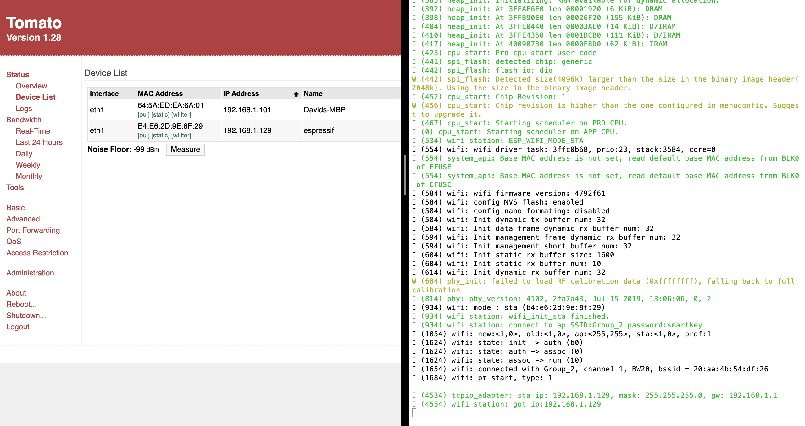

#  Wifi

Author: David Kirk, 2019-10-17

## Summary
For this skill I copied the wifi example listed in the skill description and used it to connect the ESP32 to wifi. I did not modify any code for this skill

## Sketches and Photos

## Modules, Tools, Source Used in Solution
Standard idf.py toolchain and the wifi station example.

-----

## Reminders
- Repo is private
