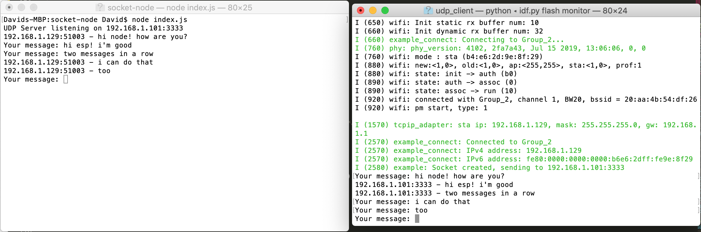

#  IP Chat

Author: David Kirk, 2019-10-22

## Summary
This is a simple chatting setup between a client (ESP-32) and a server (Node.js) on a local wifi network. Either end can send unlimited messages to the other, though the client always has to start.

## Sketches and Photos

## Modules, Tools, Source Used in Solution
Standard idf.py tools, udp_client example code, Node dgram example code

-----

## Reminders
- Repo is private
