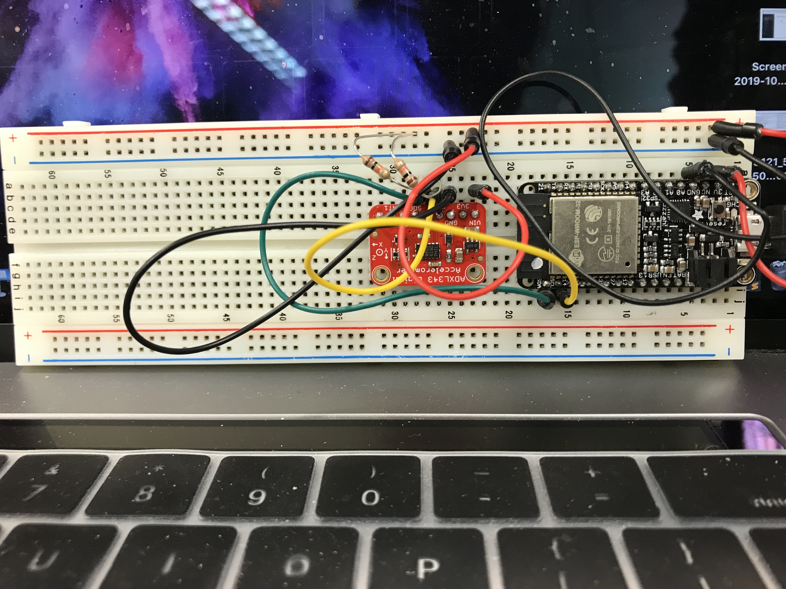

#  Triple-axis Accelerometer

Author: Kyle Martin (team skill), 2019-10-23

## Summary
In this skill, we wired the ADXL343 accelerometer to the ESP32 via SDA and SCL, both of which utilized 10kohm pull-up resistors.  In the program, we wrote three functions: one to read from an 8 bit register, one to write to an 8 bit register, one to read 16 bits, and one to convert acceleration readings in X, Y, and Z to roll and pitch values.  

In the read register function, we started the master, sent the register pointer, restarted the master, read data from the register, and stopped the master.

In the write register function, we started the master, sent the register pointer, wrote to the register, and then stopped the master.

In the read-16-bit function, we simply performed the read register function twice on adjacent registers.  Then, we concatenated these two 8-bit vales to form the 16-bit value.

In the conversion function, we used the following formulas:
- roll = atan2(y , z) * 57.3
- pitch = atan2((-1 * x) , sqrt(y * y + z * z)) * 57.3

With these functions operating in conjunction with the base code, we were able to execute the program and run the accelerometer.

## Sketches and Photos

## Modules, Tools, Source Used in Solution
- BU-EC444/code-examples/i2c-accel/
- https://cdn-learn.adafruit.com/assets/assets/000/070/556/original/adxl343.pdf?1549287964
- https://wiki.dfrobot.com/How_to_Use_a_Three-Axis_Accelerometer_for_Tilt_Sensing

## Supporting Artifacts
Demo Video: https://drive.google.com/file/d/1kDO2BmBXg0tRtNOqUuxwl8utO91g1P3s/view?usp=sharing

-----

## Reminders
- Repo is private
