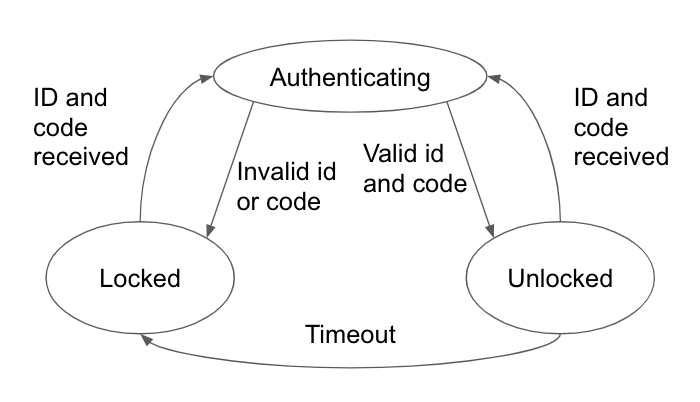

#  State Models
Author: David Kirk, 2019-11-22

## Summary
This is an entirely written skill, so I am doing it entirely within this report.

### State diagram:

### State table:

| Event              | State: Locked  | State: Authenticating | State: Unlocked |
|--------------------|----------------|-----------------------|-----------------|
| Invalid id or code | Authenticating | Locked                | Authenticating  |
| Valid id and code  | Authenticating | Unlocked              | Authenticating  |
| Timeout            | N/A            | N/A                   | Locked          |

-----

## Reminders
- Repo is private
